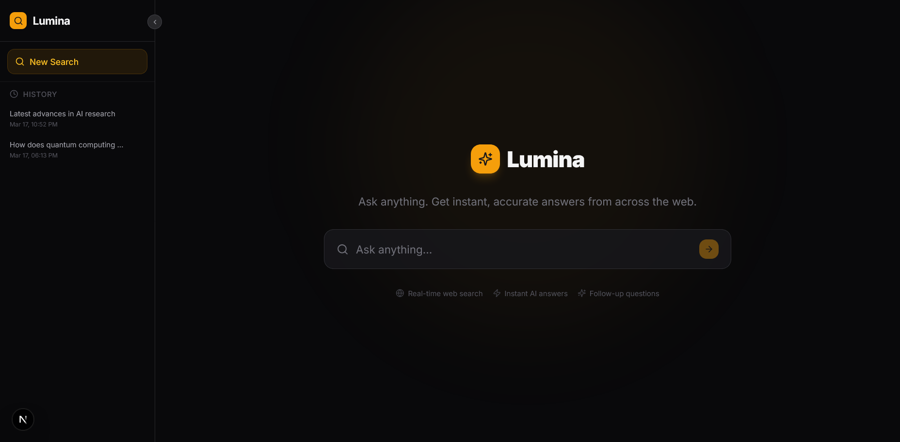
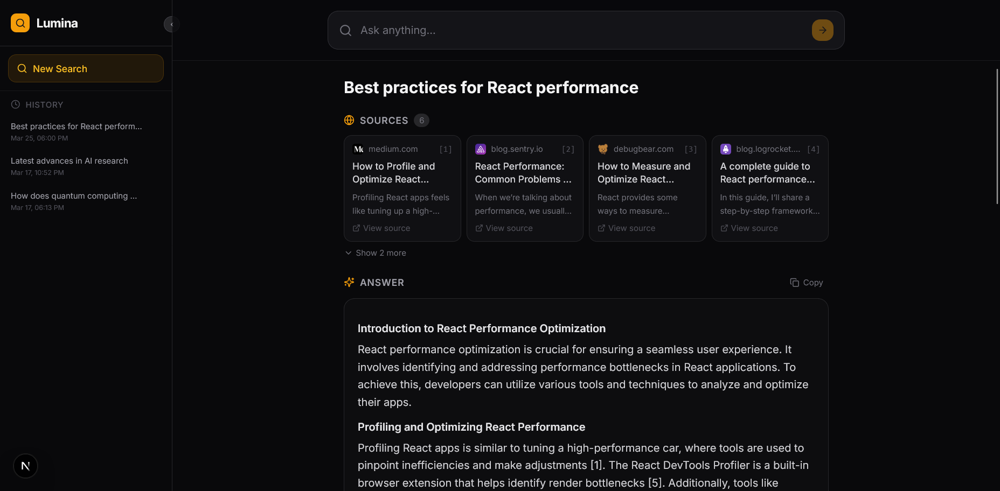
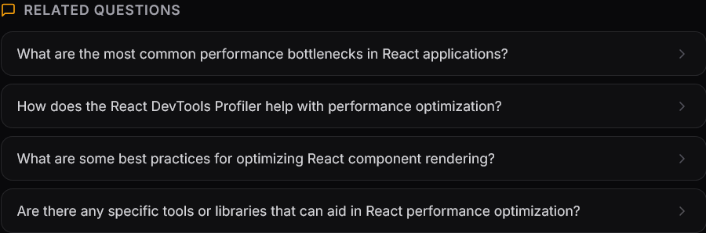
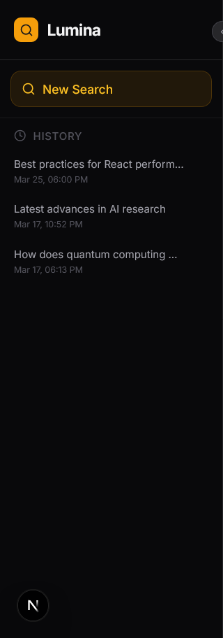
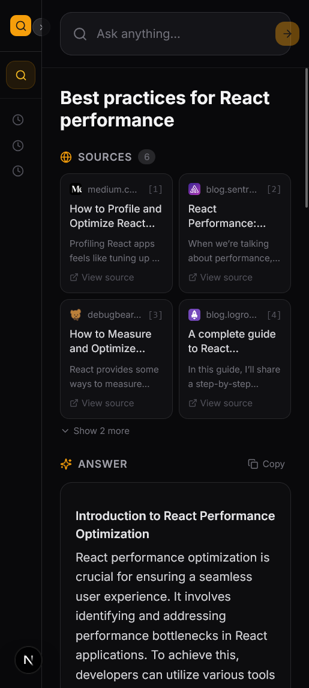

<div align="center">

<!-- PROJECT LOGO -->
<br />

```
██╗     ██╗   ██╗███╗   ███╗██╗███╗   ██╗ █████╗
██║     ██║   ██║████╗ ████║██║████╗  ██║██╔══██╗
██║     ██║   ██║██╔████╔██║██║██╔██╗ ██║███████║
██║     ██║   ██║██║╚██╔╝██║██║██║╚██╗██║██╔══██║
███████╗╚██████╔╝██║ ╚═╝ ██║██║██║ ╚████║██║  ██║
╚══════╝ ╚═════╝ ╚═╝     ╚═╝╚═╝╚═╝  ╚═══╝╚═╝  ╚═╝
```

### AI Answer Engine

**Ask anything. Get instant, cited answers from across the web — powered by Groq & LangGraph.**

<br />

[](https://nextjs.org/)
[](https://www.typescriptlang.org/)
[](https://tailwindcss.com/)
[](https://js.langchain.com/)
[](https://www.prisma.io/)
[](https://groq.com/)

<br />

[**Live Demo**](https://your-demo-url.vercel.app) · [**Report Bug**](https://github.com/yourusername/lumina/issues) · [**Request Feature**](https://github.com/yourusername/lumina/issues)

<br />

</div>

---

## 📸 Screenshots

<br />

<!-- SCREENSHOT PLACEHOLDER: Hero / Landing Page -->

> **📌 Screenshot placeholder — Hero Page**
> 
> <br />

<!-- SCREENSHOT PLACEHOLDER: Search Results with Streaming Answer -->

> **📌 Screenshot placeholder — Search Results (Streaming)**
> 
> <br />

<!-- SCREENSHOT PLACEHOLDER: Follow-up Questions -->

> **📌 Screenshot placeholder — Follow-up Questions**
> 
> <br />

<!-- SCREENSHOT PLACEHOLDER: Search History Sidebar -->

> **📌 Screenshot placeholder — Search History Sidebar**
> 
> <br />

<!-- SCREENSHOT PLACEHOLDER: Mobile View -->

> **📌 Screenshot placeholder — Mobile View**
> 
> <br />

---

## 📋 Table of Contents

- [📸 Screenshots](#-screenshots)
- [📋 Table of Contents](#-table-of-contents)
- [🔍 About the Project](#-about-the-project)
  - [Why Lumina?](#why-lumina)
- [✨ Key Features](#-key-features)
- [🛠 Tech Stack](#-tech-stack)
  - [Core Framework](#core-framework)
  - [AI \& Orchestration](#ai--orchestration)
  - [Frontend](#frontend)
  - [Backend \& Database](#backend--database)
- [🏗 Architecture Overview](#-architecture-overview)
  - [Request Lifecycle](#request-lifecycle)
  - [LangGraph Pipeline](#langgraph-pipeline)
- [📁 Project Structure](#-project-structure)
- [🚀 Getting Started](#-getting-started)
  - [Prerequisites](#prerequisites)
  - [Installation](#installation)
  - [Configuration](#configuration)
  - [Database Setup](#database-setup)
  - [Running Locally](#running-locally)
- [📡 API Reference](#-api-reference)
  - [`POST /api/search`](#post-apisearch)
  - [`POST /api/chat`](#post-apichat)
  - [`GET /api/history`](#get-apihistory)
  - [`GET /api/history/:id`](#get-apihistoryid)
  - [`DELETE /api/history/:id`](#delete-apihistoryid)
- [🔐 Environment Variables](#-environment-variables)
- [☁️ Deployment](#️-deployment)
  - [Deploy to Vercel (Recommended)](#deploy-to-vercel-recommended)
- [🗺 Roadmap](#-roadmap)
- [🤝 Contributing](#-contributing)
- [🐛 Troubleshooting](#-troubleshooting)
- [📄 License](#-license)
- [🙏 Acknowledgements](#-acknowledgements)

---

## 🔍 About the Project

**Lumina** is a production-grade AI answer engine inspired by [Perplexity.ai](https://perplexity.ai). It takes a natural-language question, searches the live web via [Tavily](https://tavily.com), synthesises a streamed answer using [Groq's](https://groq.com) ultra-fast LPU inference, and persists everything to a relational database — all inside a single Next.js 15 monorepo.

The project was built to demonstrate how **modern AI orchestration**, **real-time streaming**, and **clean software architecture** can coexist in a maintainable, deployable codebase. Every architectural decision is deliberate and documented — it serves as both a working product and a reference implementation.

### Why Lumina?

| Problem                         | How Lumina Solves It                                                                |
| ------------------------------- | ----------------------------------------------------------------------------------- |
| Generic AI chat with no sources | Every answer is grounded in live web search results with citations                  |
| Slow LLM responses feel laggy   | Groq LPU delivers ~800 tokens/sec; answers stream token-by-token                    |
| No memory between searches      | All queries, answers, and follow-ups are persisted to a database                    |
| AI pipelines are hard to extend | LangGraph models the pipeline as a typed state machine — add a node, not a function |

---

## ✨ Key Features

- 🔍 **Real-time Web Search** — Fetches 6 live sources per query via the Tavily API, with favicons, titles, and snippets
- ⚡ **Token-level Streaming** — Answers stream word-by-word via Server-Sent Events (SSE); users see progress instantly
- 🧠 **LangGraph AI Pipeline** — Three-node state machine: `fetch_sources → generate_answer → generate_followups`
- 📚 **Source Attribution** — Inline `[1]`, `[2]` citations in every answer; click any source card to read the original
- 💬 **Follow-up Conversations** — 4 AI-suggested follow-up questions; click to expand inline answers
- 🗂️ **Persistent History** — All searches saved to SQLite (dev) / PostgreSQL (prod); browse and resume from the sidebar
- 🎨 **Markdown Rendering** — Full GitHub-flavoured markdown: headers, tables, code blocks, bold, inline code
- 📱 **Responsive Design** — Works on desktop, tablet, and mobile; collapsible sidebar in all viewports
- 🗑️ **History Management** — Delete individual searches from the sidebar; cascade-deletes all associated data
- ⌨️ **Keyboard Shortcuts** — Press `/` anywhere to focus the search bar; `Escape` to clear; `Enter` to search

---

## 🛠 Tech Stack

### Core Framework

| Technology                                    | Version | Purpose                                 |
| --------------------------------------------- | ------- | --------------------------------------- |
| [Next.js](https://nextjs.org/)                | 15      | Full-stack React framework (App Router) |
| [TypeScript](https://www.typescriptlang.org/) | 5       | End-to-end type safety                  |
| [React](https://react.dev/)                   | 19      | UI library                              |

### AI & Orchestration

| Technology                                                       | Version | Purpose                                  |
| ---------------------------------------------------------------- | ------- | ---------------------------------------- |
| [LangGraph](https://langchain-ai.github.io/langgraphjs/)         | 0.2     | AI pipeline state machine                |
| [LangChain](https://js.langchain.com/)                           | 0.3     | LLM abstractions and tools               |
| [@langchain/groq](https://www.npmjs.com/package/@langchain/groq) | 0.1     | Groq model integration                   |
| [Groq API](https://console.groq.com/)                            | —       | Ultra-fast LPU inference (llama-3.3-70b) |
| [Tavily API](https://tavily.com/)                                | —       | AI-optimised web search                  |
| [Vercel AI SDK](https://sdk.vercel.ai/)                          | 4       | Streaming utilities                      |

### Frontend

| Technology                                                   | Version | Purpose                  |
| ------------------------------------------------------------ | ------- | ------------------------ |
| [Tailwind CSS](https://tailwindcss.com/)                     | 3.4     | Utility-first styling    |
| [Zustand](https://zustand-demo.pmnd.rs/)                     | 5       | Global state management  |
| [Framer Motion](https://www.framer.com/motion/)              | 11      | Animations               |
| [React Markdown](https://github.com/remarkjs/react-markdown) | 9       | Markdown rendering       |
| [Lucide React](https://lucide.dev/)                          | 0.469   | Icon library             |
| [Radix UI](https://www.radix-ui.com/)                        | —       | Accessible UI primitives |

### Backend & Database

| Technology                           | Version | Purpose                    |
| ------------------------------------ | ------- | -------------------------- |
| [Prisma ORM](https://www.prisma.io/) | 6       | Type-safe database access  |
| SQLite                               | —       | Local development database |
| PostgreSQL                           | —       | Production database        |
| [Zod](https://zod.dev/)              | 3       | Runtime schema validation  |

---

## 🏗 Architecture Overview

Lumina follows a **three-tier architecture** — all tiers live in one Next.js monorepo:

```
┌─────────────────────────────────────────────────────────────┐
│                    BROWSER (React + Zustand)                 │
│  SearchBar → useSearch hook → Zustand Store → UI Components │
└─────────────────────┬───────────────────────────────────────┘
                      │  SSE Stream (text/event-stream)
                      │  JSON REST (follow-ups, history)
┌─────────────────────▼───────────────────────────────────────┐
│              NEXT.JS 15 APP ROUTER (API Routes)              │
│   POST /api/search   POST /api/chat   GET /api/history       │
└─────────────────────┬───────────────────────────────────────┘
                      │
         ┌────────────┼──────────────┐
         │            │              │
┌────────▼───┐  ┌─────▼─────┐  ┌───▼──────────┐
│   Tavily   │  │ Groq LLM  │  │  LangGraph   │
│ Web Search │  │ llama-70b │  │  State Graph │
└────────────┘  └─────┬─────┘  └──────────────┘
                      │
┌─────────────────────▼───────────────────────────────────────┐
│                PRISMA ORM  →  SQLite / PostgreSQL            │
│         Search  ←→  Source[]  ←→  FollowUp[]                │
└─────────────────────────────────────────────────────────────┘
```

### Request Lifecycle

```
1. User types query        →  SearchBar calls useSearch().search(query)
2. Zustand state update    →  startSearch() → isLoading: true, isStreaming: true
3. POST /api/search        →  Zod validates; SSE ReadableStream opened
4. Tavily web search       →  6 sources fetched → { type: 'sources' } emitted
5. Groq LLM streaming      →  Token-by-token → { type: 'token' } per token
6. Follow-up generation    →  JSON array of 4 questions → { type: 'followups' }
7. Prisma persistence      →  Search + Sources saved atomically → { type: 'done', searchId }
8. Client reconstruction   →  useSearch hook assembles state; React renders incrementally
```

### LangGraph Pipeline

```
       ┌─────────┐
  ┌────►  START  ├────┐
  │    └─────────┘    │
  │                   ▼
  │    ┌──────────────────────┐
  │    │    fetch_sources      │  → calls Tavily API
  │    │   (node 1 of 3)      │  → returns Source[]
  │    └──────────┬───────────┘
  │               ▼
  │    ┌──────────────────────┐
  │    │   generate_answer    │  → calls Groq (non-streaming)
  │    │   (node 2 of 3)      │  → returns answer string
  │    └──────────┬───────────┘
  │               ▼
  │    ┌──────────────────────┐
  │    │  generate_followups  │  → calls Groq (JSON mode)
  │    │   (node 3 of 3)      │  → returns string[]
  │    └──────────┬───────────┘
  │               ▼
  │            ┌─────┐
  └────────────►  END │
               └─────┘
```

---

## 📁 Project Structure

```
lumina/
│
├── prisma/
│   └── schema.prisma            # DB schema: Search, Source, FollowUp models
│
├── src/
│   ├── app/                     # Next.js 15 App Router
│   │   ├── layout.tsx           # Root layout — fonts, dark mode, Sidebar wrapper
│   │   ├── page.tsx             # Home — conditionally renders Hero or Results
│   │   ├── globals.css          # Tailwind base + custom scrollbar + animations
│   │   │
│   │   ├── api/
│   │   │   ├── search/
│   │   │   │   └── route.ts     # POST — SSE streaming search endpoint
│   │   │   ├── chat/
│   │   │   │   └── route.ts     # POST — follow-up answer endpoint
│   │   │   └── history/
│   │   │       ├── route.ts     # GET — history list
│   │   │       └── [id]/
│   │   │           └── route.ts # GET / DELETE — single search record
│   │   │
│   │   └── search/
│   │       └── [id]/
│   │           ├── page.tsx              # Server Component — DB fetch
│   │           └── SearchDetailClient.tsx # Client Component — interactive view
│   │
│   ├── components/
│   │   ├── layout/
│   │   │   └── Sidebar.tsx      # Collapsible sidebar with history
│   │   └── search/
│   │       ├── SearchBar.tsx    # Controlled input with shortcuts & suggestions
│   │       ├── HeroSearch.tsx   # Landing page hero with large search bar
│   │       ├── SearchResults.tsx # Full results layout (sticky bar + panels)
│   │       ├── SourceCard.tsx   # Individual source card (favicon + link)
│   │       ├── SourcesList.tsx  # Responsive source grid with skeletons
│   │       ├── AnswerPanel.tsx  # Streaming markdown answer with copy button
│   │       ├── FollowUpSection.tsx # Suggestions + expandable follow-up answers
│   │       └── StatusBar.tsx    # Loading status indicator
│   │
│   ├── hooks/
│   │   ├── useSearch.ts         # SSE stream consumer → Zustand dispatch
│   │   └── useHistory.ts        # History CRUD (fetch, delete)
│   │
│   ├── lib/
│   │   ├── agents/
│   │   │   └── answer.agent.ts  # LangGraph graph + Groq streaming functions
│   │   ├── db/
│   │   │   ├── prisma.ts        # Singleton PrismaClient (globalThis pattern)
│   │   │   └── search.repository.ts # Data access layer — all Prisma queries
│   │   ├── tools/
│   │   │   └── web-search.tool.ts # Tavily search wrapper + LangChain tool
│   │   └── utils.ts             # cn(), formatDate(), truncate()
│   │
│   ├── store/
│   │   └── search.store.ts      # Zustand store — all streaming state
│   │
│   └── types/
│       └── index.ts             # Shared TypeScript types (Source, SearchResult, etc.)
│
├── .env.example                 # Environment variable template
├── next.config.ts               # Next.js config (external packages, image domains)
├── tailwind.config.ts           # Tailwind config (custom fonts, animations)
├── tsconfig.json                # TypeScript config with @/* path alias
└── prisma/schema.prisma         # Database schema
```

---

## 🚀 Getting Started

### Prerequisites

Ensure you have the following installed:

```bash
node --version   # v18.17.0 or higher
npm --version    # v9.0.0 or higher
git --version    # any recent version
```

> **Tip:** Use [nvm](https://github.com/nvm-sh/nvm) to manage Node.js versions.
> Run `nvm use 20` to switch to Node 20 LTS.

### Installation

**1. Clone the repository**

```bash
git clone https://github.com/yourusername/lumina.git
cd lumina
```

**2. Install dependencies**

```bash
npm install
```

> This installs approximately 400 MB of packages. Allow 1–3 minutes on first run.

### Configuration

**3. Create your environment file**

```bash
cp .env.example .env
```

**4. Get your API keys**

You need two free API keys:

<details>
<summary><strong>🔑 Groq API Key</strong> (free, no credit card required)</summary>

1. Go to [console.groq.com](https://console.groq.com)
2. Sign up or log in
3. Navigate to **API Keys** in the left sidebar
4. Click **Create API Key** → name it `lumina-dev`
5. Copy the key — it starts with `gsk_`

</details>

<details>
<summary><strong>🔑 Tavily API Key</strong> (free, 1000 searches/month)</summary>

1. Go to [tavily.com](https://tavily.com)
2. Click **Get Started** → create an account
3. Your API key is shown on the dashboard after login
4. Copy the key — it starts with `tvly-`

</details>

**5. Fill in your `.env` file**

```env
# Required — LLM inference (Groq)
GROQ_API_KEY=gsk_xxxxxxxxxxxxxxxxxxxxxxxxxxxxxxxxxxxx

# Required — Web search (Tavily)
TAVILY_API_KEY=tvly-xxxxxxxxxxxxxxxxxxxxxxxxxxxxxxxxxxxx

# Database — SQLite for local development
DATABASE_URL="file:./dev.db"

# App URL
NEXT_PUBLIC_APP_URL=http://localhost:3000
```

### Database Setup

**6. Generate the Prisma client and create the database**

```bash
# Generate the TypeScript client from schema.prisma
npx prisma generate

# Create the database and tables
npm run db:push
```

Expected output:

```
✔  Generated Prisma Client (v6.x.x)
✔  Your database is now in sync with your Prisma schema. Done in 42ms
```

This creates `prisma/dev.db` — a local SQLite file. No external database service needed.

> **Optional:** Open the visual database browser:
>
> ```bash
> npm run db:studio
> # Opens at http://localhost:5555
> ```

### Running Locally

**7. Start the development server**

```bash
npm run dev
```

Expected output:

```
  ▲ Next.js 15.x.x
  - Local:    http://localhost:3000
  - Network:  http://192.168.x.x:3000

 ✓ Starting...
 ✓ Ready in 1.8s
```

Open **[http://localhost:3000](http://localhost:3000)** in your browser.

**8. Test the setup**

Try these three things to confirm everything works:

| Test                            | Expected Result                                    |
| ------------------------------- | -------------------------------------------------- |
| Type a question and press Enter | Sources appear in ~2s, answer streams word-by-word |
| Click a follow-up suggestion    | Answer expands inline below the suggestion         |
| Check the left sidebar          | Your search appears in history with a timestamp    |

---

## 📡 API Reference

### `POST /api/search`

Initiates a search and streams the response as Server-Sent Events.

**Request body:**

```json
{
  "query": "How does quantum computing work?"
}
```

**Response:** `Content-Type: text/event-stream`

Each SSE event is a JSON object on a `data:` line:

```
data: {"type":"status","message":"Searching the web..."}

data: {"type":"sources","sources":[{"url":"...","title":"...","snippet":"...","favicon":"..."}]}

data: {"type":"token","content":"Quantum "}

data: {"type":"token","content":"computing "}

data: {"type":"followups","followUps":["What are qubits?","..."]}

data: {"type":"done","searchId":"clxyz123..."}
```

**Error response:**

```
data: {"type":"error","error":"TAVILY_API_KEY is not set"}
```

---

### `POST /api/chat`

Answers a follow-up question in the context of an existing search.

**Request body:**

```json
{
  "searchId": "clxyz123...",
  "question": "What are the practical applications?"
}
```

**Response:** `200 OK`

```json
{
  "id": "clfollow456...",
  "question": "What are the practical applications?",
  "answer": "Quantum computers have several practical...",
  "searchId": "clxyz123...",
  "createdAt": "2025-01-15T10:30:00.000Z"
}
```

---

### `GET /api/history`

Returns the 30 most recent searches (lightweight — no answer text).

**Response:** `200 OK`

```json
[
  {
    "id": "clxyz123...",
    "query": "How does quantum computing work?",
    "createdAt": "2025-01-15T10:30:00.000Z"
  }
]
```

---

### `GET /api/history/:id`

Returns a complete search record including all sources and follow-ups.

**Response:** `200 OK`

```json
{
  "id": "clxyz123...",
  "query": "How does quantum computing work?",
  "answer": "## Quantum Computing\n\nQuantum computing...",
  "sources": [...],
  "followUps": [...],
  "createdAt": "2025-01-15T10:30:00.000Z"
}
```

---

### `DELETE /api/history/:id`

Permanently deletes a search and all associated sources and follow-ups (cascade delete).

**Response:** `200 OK`

```json
{ "success": true }
```

---

## 🔐 Environment Variables

| Variable              | Required | Description                        | Example                     |
| --------------------- | -------- | ---------------------------------- | --------------------------- |
| `GROQ_API_KEY`        | ✅ Yes   | Groq API key for LLM inference     | `gsk_abc...`                |
| `TAVILY_API_KEY`      | ✅ Yes   | Tavily API key for web search      | `tvly-xyz...`               |
| `DATABASE_URL`        | ✅ Yes   | Database connection string         | `file:./dev.db`             |
| `NEXT_PUBLIC_APP_URL` | ⬜ No    | Public base URL of your deployment | `https://lumina.vercel.app` |

> **Security:** Never commit your `.env` file to version control. It is already in `.gitignore`.
> Use your hosting provider's environment variable settings for production secrets.

---

## ☁️ Deployment

### Deploy to Vercel (Recommended)

**1. Push your code to GitHub**

```bash
git add .
git commit -m "initial commit"
git push origin main
```

**2. Import to Vercel**

Visit [vercel.com/new](https://vercel.com/new) and import your GitHub repository.

**3. Add environment variables in the Vercel dashboard**

```
GROQ_API_KEY        → your Groq key
TAVILY_API_KEY      → your Tavily key
DATABASE_URL        → your PostgreSQL connection string (see below)
NEXT_PUBLIC_APP_URL → https://your-project.vercel.app
```

**4. Switch to PostgreSQL for production**

Update `prisma/schema.prisma`:

```prisma
datasource db {
  provider = "postgresql"
  url      = env("DATABASE_URL")
}
```

Recommended PostgreSQL providers (all have free tiers):

- [Vercel Postgres](https://vercel.com/docs/storage/vercel-postgres)
- [Neon](https://neon.tech) — serverless PostgreSQL
- [Supabase](https://supabase.com) — Postgres with extras

**5. Run migrations**

```bash
npm run db:migrate
```

**6. Deploy**

Vercel automatically deploys on every push to `main`. Your app will be live at `https://your-project.vercel.app`.

---

## 🗺 Roadmap

- [x] Real-time SSE streaming answer
- [x] Tavily web search integration
- [x] LangGraph AI pipeline
- [x] Follow-up conversation support
- [x] Persistent search history
- [x] Markdown rendering with syntax highlighting
- [x] Collapsible sidebar with history
- [ ] **Authentication** — NextAuth.js with GitHub / Google OAuth
- [ ] **Semantic caching** — Skip Tavily call if a similar query was answered recently
- [ ] **Query rewriting** — LangGraph node to improve ambiguous queries before searching
- [ ] **Image results** — Display relevant images alongside text answers
- [ ] **Export** — Download answer as PDF or Markdown
- [ ] **Rate limiting** — Upstash Redis rate limiting on `/api/search`
- [ ] **Streaming follow-ups** — Token-by-token streaming for follow-up answers
- [ ] **Search within history** — PostgreSQL full-text search across saved answers
- [ ] **Dark/light theme toggle** — User-controlled theme preference

See the [open issues](https://github.com/yourusername/lumina/issues) for the full list of proposed features.

---

## 🤝 Contributing

Contributions are what make open-source projects great. Any contributions you make are **greatly appreciated**.

**1. Fork the repository**

```bash
git clone https://github.com/yourusername/lumina.git
```

**2. Create a feature branch**

```bash
git checkout -b feature/add-image-results
```

**3. Make your changes**

Follow the existing patterns:

- Components go in `src/components/`
- New API routes go in `src/app/api/`
- New LangGraph nodes go in `src/lib/agents/answer.agent.ts`
- All TypeScript types go in `src/types/index.ts`

**4. Commit with a descriptive message**

```bash
git commit -m "feat: add image results to search response"
```

We follow [Conventional Commits](https://www.conventionalcommits.org/):
`feat:` | `fix:` | `docs:` | `style:` | `refactor:` | `test:` | `chore:`

**5. Push and open a Pull Request**

```bash
git push origin feature/add-image-results
```

Then open a PR on GitHub. Please include a description of your changes and any relevant screenshots.

---

## 🐛 Troubleshooting

<details>
<summary><strong>Error: GROQ_API_KEY is not set</strong></summary>

Your `.env` file is missing or the key name is incorrect.

```bash
cat .env   # confirm the file has content and correct variable names
```

Ensure you copied `.env.example` to `.env` (not `.env.local` or `.env.development`).

</details>

<details>
<summary><strong>Cannot find module '@prisma/client'</strong></summary>

The Prisma client has not been generated. Run:

```bash
npx prisma generate
npm run db:push
```

</details>

<details>
<summary><strong>Port 3000 is already in use</strong></summary>

Run on a different port:

```bash
npm run dev -- -p 3001
```

Then open [http://localhost:3001](http://localhost:3001).

</details>

<details>
<summary><strong>Database errors / "table does not exist"</strong></summary>

Reset the local database:

```bash
rm -f prisma/dev.db
npm run db:push
```

</details>

<details>
<summary><strong>npm install fails with peer dependency errors</strong></summary>

```bash
rm -rf node_modules package-lock.json
npm install --legacy-peer-deps
```

</details>

---

## 📄 License

Distributed under the MIT License. See [`LICENSE`](./LICENSE) for more information.

---

## 🙏 Acknowledgements

This project was built using the following outstanding open-source projects and services:

- [Next.js](https://nextjs.org/) — The React framework for the web
- [LangChain](https://js.langchain.com/) — Building applications with LLMs
- [LangGraph](https://langchain-ai.github.io/langgraphjs/) — Stateful agent orchestration
- [Groq](https://groq.com/) — Ultra-fast LPU inference
- [Tavily](https://tavily.com/) — AI-optimised search API
- [Prisma](https://www.prisma.io/) — Next-generation ORM for Node.js & TypeScript
- [Zustand](https://github.com/pmndrs/zustand) — Bare-bones state management for React
- [Tailwind CSS](https://tailwindcss.com/) — A utility-first CSS framework
- [Radix UI](https://www.radix-ui.com/) — Unstyled, accessible UI components
- [Lucide](https://lucide.dev/) — Beautiful & consistent icon library
- [Perplexity.ai](https://perplexity.ai/) — Original inspiration for this project

---

<div align="center">

Made with ❤️ and ☕

**[⬆ Back to top](#)**

</div>
